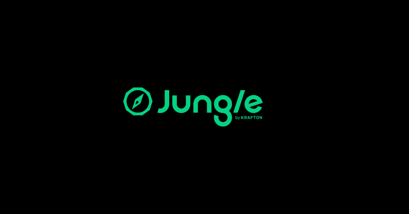

## 이번 주 목표

- 문제해결
	- 목표: 힌트를 보지 않고 알고리즘 문제를 해결할 수 있다.
		- 결과: 60% (그래프 문제 중에 힌트를 보지 않고 해결할 수 있는 문제도 있었다. 하지만 DP 문제는 여전히 어려워서 힌트를 참고했다.)
- 설계
	- 목표: 처음 보는 문제에 적절한 알고리즘을 떠올릴 수 있다.
		- 결과: 60% (설명은 다르지만 DFS나 BFS를 적용해야 할 것 같은 문제들이 있었다. 이런 문제는 정형화된 코드를 적용하는 것으로 해결할 수 있었다.)
- 구현
	- 목표: 설계한 알고리즘을 파이썬 코드로 구현할 수 있다.
		- 결과: 70% (의도대로 동작하는 코드를 구현할 수 있으나 구현 도중 파이썬 문법을 몰라 검색하는 경우가 있었다.)
- 품질
	- 목표: 썼던 코드를 다시 봤을 때 의미를 이해할 수 있다.
		- 결과: 60% (코드의 의미 자체는 다시 보면 알 수 있지만, 조금 시간이 걸렸다.)
- 유지보수
	- 목표: 유지보수는 당장 생각하지 않고 구현에 집중한다.
		- 결과: 최대한 코드 줄 수를 줄이는 방법을 알아보며 가독성을 높이는 방법을 검색했다.
- 협업
	- 목표: 팀원에게 알고리즘을 설명할 수 있다.
		- 결과: 60% (코드를 그대로 읽은 것 같아서 아쉬움이 남는다.)
- 태도
	- 목표: 알고리즘 문제를 한 번 푼 것으로 끝내지 않는다.
		- 결과: 70% (해결했던 문제를 다시 시도해보며 점검했다.)
- 비즈니스 이해
	- 목표: 배운 알고리즘의 어떻게 활용하는지 알 수 있다.
		- 결과: 70% (간단히 개념과 알고리즘의 활용처를 알아보았다.)
- AI 활용
	- 목표: 정답 확인과 파이썬 문법에 대해 물어보는 것에만 사용한다.
		- 결과: 50% (2시간 이상 봐도 도저히 답이 나오지 않는 문제들이 많아 풀이를 확인하며 공부했다.)
- 학습 민첩성
	- 목표: 주어진 과제를 Advanced 까지 해결한다.
		- 결과: 70% (이번에 Extra 중에서도 풀이를 보지 않고 몇 가지 해결했다.)

## 시도한 접근 방식

이번 주도 문제 풀이에 그림을 그리긴 했지만, 문제 풀이 뿐만 아니라 개념 공부에도 그림을 그리며 공부하였다. 트리나 그래프와 같은 비선형 자료구조는 직접 그리는 편이 훨씬 잘 이해가 되어 이번 주에는 이를 활용했다.

특히 이번 주가 그리거나 표를 만들지 않고 눈으로만 보려고 하면 어려운 문제들이 많았다. 내가 그린 그림을 AI에게 보여주며 맞는지 점검도 해보고, 점화식을 세우기 위해 행렬을 일일이 채워보기도 했다. 실패하는 경우도 있었지만 그만큼 생각의 폭을 넓힐 수 있는 시간인 것 같다.

## 문제와 해결 과정

이번에 가장 힘들었던 것은 최대한 많은 문제를 해결하고 싶어서 빨리 넘기니 다시 그 문제를 봤을 때 개념을 응용하는 것이 어려웠다는 점이다. 힌트가 있는 문제를 풀 때는 개념을 대충 익혀도 문제를 풀 수 있었다. 게다가 지우고 다시 풀더라도 같은 문제라서 코드를 외워버리게 된다.

이 공부법의 단점은 새로운 유형을 풀 때 마주하게 된다. 분명 같은 그래프 문제지만, 개념을 적용한다고 쳐도 어떻게 활용할지는 떠올리지 못한다.

다행히 해결책이 있었다. Extra 문제는 모두 [LeetCode](https://leetcode.com/)에 있어서 Discussion에서 댓글을 확인할 수 있다. 정답 대신 힌트가 되는 풀이가 공유되어 basic이나 advanced의 문제를 풀 때처럼 힌트를 확인할 수 있다. 때로는 테스트 케이스를 공유하는 댓글도 있어서 이를 참고할 수 있었다.

이때 알게 된 것은 생각보다 옛날에도 많은 사람들이 고민하고 있었다는 것이다.

## 새롭게 배운 점

- 트리의 탐색에도 dfs나 bfs를 활용할 수 있다는 것을 알게 되었다.
- 개념을 알아도 응용하지 못하는 점을 해결하기 위해서는 최대한 많은 문제를 풀어보는 게 사고를 넓히는 데에 도움이 된다.
- 동적 프로그래밍의 상향식과 하향식의 차이에 대해 알게 되었다. 상향식은 미리 배열을 만들어두는 것, 하향식은 연산 과정에서 메모를 해두고 다음 연산에 필요하다면 메모를 활용하는 것으로 이해했다.
- 파이썬에 이진 탐색을 구현해놓은 함수가 있다. `bisect_left()` 혹은 `bisect_right()` 를 통해 찾는 값의 인덱스를 알아낼 수 있다.
- 문자 자료형을 유니코드 정수로 변환할 수 있는 함수 `ord()`를 알게 되었다.

## 다음 주 계획

다음 주는 그동안 배운 자료구조를 C언어로 구현해보는 시간이라고 한다. 비록 C언어를 이전에 배웠다고 하더라도 그때로부터 시간이 꽤 지났기 때문에 새로 배운다는 생각으로 적응할 것이다.

CSAPP에 나온 개념이나 추상화같은 내용들이 아직 와닿지 않았다. 책의 내용을 좀 더 잘 이해하기 위해 유튜브에 있는 강의 영상이나 혹은 AI를 사용한다던지 등 이해하기 위한 방법을 찾아볼 생각이다.
